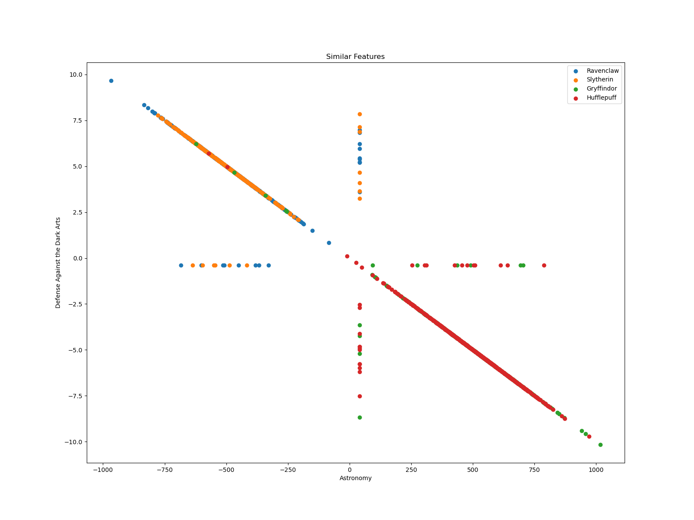
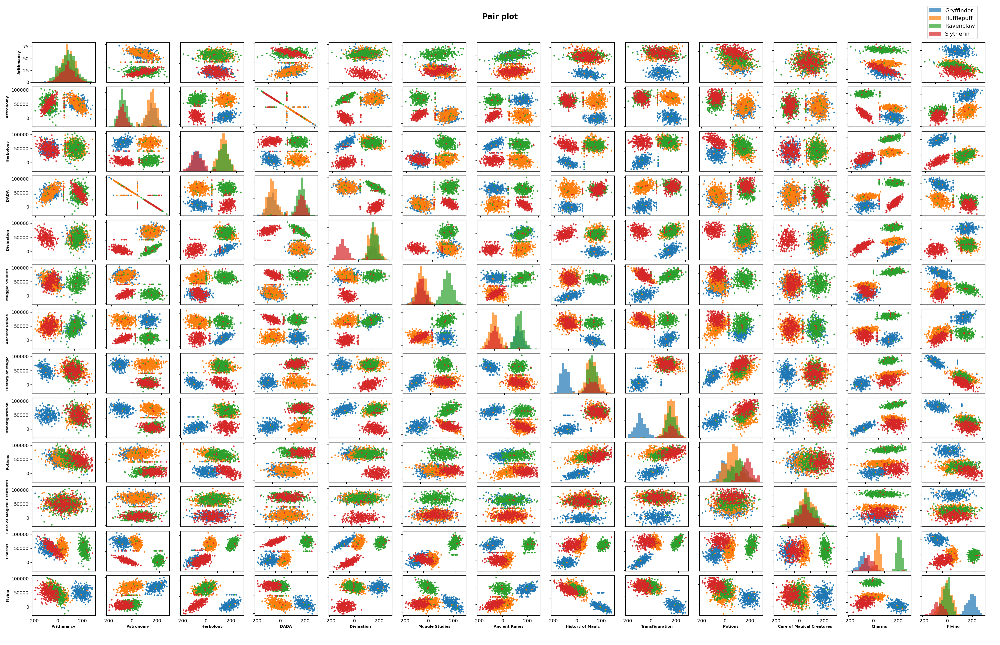

# dslr
## 📝 Overview
- DSLR (Data Science Logistic Regression) is a one-vs-all logistic regression classifier designed to predict Hogwarts Houses based on student attributes.
- The project follows gradient descent optimization to train a logistic regression model and make predictions with high accuracy.

> The **goal** is to classify students into Gryffindor, Slytherin, Hufflepuff, or Ravenclaw based on features extracted from the dataset.<br />The model is evaluated against a ground truth dataset, and its accuracy is measured.

---

## 🔥 Features
✔️ **Train a logistic regression model** using batch, stochastic, or mini-batch gradient descent<br />
✔️ **Make predictions** for new data based on trained weights<br />
✔️ **Evaluate accuracy** using Scikit-Learn’s accuracy score<br />
✔️ **Graphic visualizations** like histograms and scatter plots<br />
✔️ **Weights saved and loaded from JSON** for reuse in predictions

---

## 📁 Setup
### ⚙️ Install requirements
This project requires Python and the following libraries:
- `numpy`
- `pandas`
- `matplotlib`

### 🚀 Usage
1️⃣ Clone this repository:
```
git clone https://github.com/your-username/dslr.git
cd dslr
```

2️⃣ Train the Model: <br />
- Train the model on `dataset_train.csv` and save the weights to `weights.json`:
```
python3 logreg_train.py data/dataset_train.csv
```

- Optional: Use Stochastic gradient descent `(-s)` or Mini-batch `(-m)`
```
python3 logreg_train.py datasets/dataset_train.csv -s
```

2️⃣ Predict Hogwarts Houses
Use the trained model to classify students from `dataset_test.csv`:
```
python3 logreg_predict.py datasets/dataset_test.csv weights.json
```

3️⃣ Evaluate the Model
```
python3 evaluate.py
```

## 📊 Visualize the Data
Explore the dataset using different visualizations:

📌 **Histogram**: Shows the distribution of numerical features.
```
python3 histogram.py
```
<div align="center">
  
</div>
<br />

📌 **Scatter Plot**: Displays feature relationships across Hogwarts Houses.
```
python3 scatter_plot.py
```
<div align="center">
  
</div> 
<br />

📌 **Pair Plot**: Helps identify patterns and separability between classes.
```
python3 pair_plot.py
```
<div align="center">
  
</div>

### ✨ My Teammate => [Belen](https://github.com/belenarbizu)